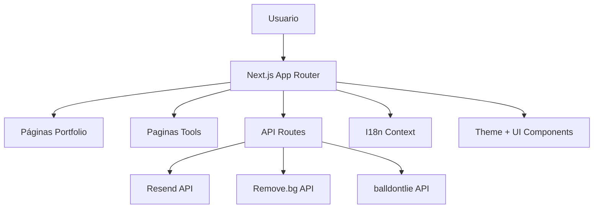

# Fernando Máximo | Dev Hub Portfolio

<p align="center">
   
   
   
   
   
</p>

<p align="center">
   Portfolio profesional + laboratorio de herramientas web orientadas a productividad, desarrollo, imagen, texto, seguridad y conversión.
</p>

---

## Vista General

Este proyecto es mi hub personal: una mezcla entre portfolio técnico y suite de utilidades online construida con una arquitectura moderna en Next.js App Router.

Incluye:
- Landing personal con secciones animadas, perfil profesional y CTA.
- Páginas dedicadas de experiencia, stack, proyectos y contacto.
- Colección de herramientas web reutilizables con enfoque en UX y rendimiento.
- Endpoints API internos para contacto, remove.bg y datos NBA.
- Soporte i18n en español, inglés y alemán.
- Preparado para despliegue en Docker (self-hosted o cloud).

---

## Índice

1. [Highlights](#highlights)
2. [Stack Tecnológico](#stack-tecnológico)
3. [Arquitectura del Proyecto](#arquitectura-del-proyecto)
4. [Rutas Principales](#rutas-principales)
5. [Herramientas Incluidas](#herramientas-incluidas)
6. [APIs y Variables de Entorno](#apis-y-variables-de-entorno)
7. [Puesta en Marcha Local](#puesta-en-marcha-local)
8. [Despliegue con Docker](#despliegue-con-docker)
9. [Scripts Disponibles](#scripts-disponibles)
10. [SEO, OG y PWA](#seo-og-y-pwa)
11. [Roadmap](#roadmap)
12. [Contacto](#contacto)

---

## Highlights

### Portfolio
- Diseño cuidado con animaciones usando Framer Motion.
- Secciones de valor: About, proyectos destacados, experiencia y certificaciones.
- Componente de búsqueda rápida tipo command palette.
- Modo visual inmersivo con companion UI, barra de progreso y efectos dinámicos.

### Hub de herramientas
- 30+ herramientas web en una sola app.
- Flujo client-first para utilidades rápidas.
- Integraciones externas cuando aporta valor (Remove.bg, balldontlie, Resend).

### Product-ready
- Next.js App Router + TypeScript.
- Docker multi-stage optimizado para producción.
- Metadata SEO, Open Graph image dinámica y manifest PWA.

---

## Stack Tecnológico

### Core
- Next.js 16
- React 19
- TypeScript 5

### UI/UX
- Tailwind CSS 4
- Framer Motion
- Lucide React
- shadcn/ui + utilidades CVA/clsx/tailwind-merge

### Tooling y utilidades
- ESLint 9
- FFmpeg.wasm
- react-dropzone
- prismjs
- html2canvas

### Servicios externos
- Resend (envío de mensajes de contacto)
- Remove.bg API (eliminación de fondo)
- balldontlie API (NBA scores/stats)

---

## Arquitectura del Proyecto



Estructura principal:
- app: rutas, layouts, páginas y endpoints API.
- components: UI compartida y bloques de home/layout.
- i18n: contexto, traducciones y tipado de idiomas.
- lib: utilidades auxiliares.
- public: assets estáticos y manifest.

---

## Rutas Principales

### Navegación
- /
- /projects
- /experience
- /stack
- /contact
- /tools

### API internas
- POST /api/contact
- POST /api/remove-bg
- GET /api/nba

---

## Herramientas Incluidas

### Imagen y color
- /tools/bg-remover
- /tools/image-forge
- /tools/image-compressor
- /tools/exif-reader
- /tools/color-blindness
- /tools/palette-extractor
- /tools/image-color-picker
- /tools/gradient-generator
- /tools/favicon-generator

### Video
- /tools/video-crunch

### Código
- /tools/snippet-generator
- /tools/json-formatter
- /tools/svg-to-datauri
- /tools/code-beautifier

### Texto
- /tools/word-counter
- /tools/text-diff
- /tools/lorem-ipsum
- /tools/markdown-editor

### Seguridad
- /tools/password-generator
- /tools/hash-generator
- /tools/base64
- /tools/text-encryptor
- /tools/jwt-decoder

### Conversión y datos
- /tools/data-converter
- /tools/unix-timestamp
- /tools/csv-json
- /tools/qr-code
- /tools/aspect-ratio

### Dev tools
- /tools/gitignore-generator
- /tools/readme-generator
- /tools/regex-tester
- /tools/cron-helper

### Sports
- /tools/nba-scores

---

## APIs y Variables de Entorno

Crea un archivo .env.local en raíz:

```env
RESEND_API_KEY=
REMOVE_BG_API_KEY=
NBA_API_KEY=
```

### Detalle de uso
- RESEND_API_KEY: necesario para enviar formularios de contacto.
- REMOVE_BG_API_KEY: necesario para procesar eliminación de fondo.
- NBA_API_KEY: necesario para consultar datos NBA vía balldontlie.

Si una clave no está definida, la ruta correspondiente responde con error controlado.

---

## Puesta en Marcha Local

### 1) Requisitos
- Node.js 20+
- npm 10+

### 2) Instalar dependencias

```bash
npm install
```

### 3) Configurar entorno

```bash
cp .env.example .env.local
```

Si no tienes .env.example, crea .env.local manualmente con las variables anteriores.

### 4) Ejecutar en desarrollo

```bash
npm run dev
```

Abre:
- http://localhost:3000

---

## Despliegue con Docker

El proyecto incluye Dockerfile multi-stage y docker-compose para producción.

### Levantar contenedor

```bash
docker compose up -d --build
```

### Detalles relevantes
- Puerto publicado: 80 -> 3000
- Contenedor: mi-portfolio-nextjs
- Reinicio automático: always
- Imagen final optimizada usando salida standalone de Next.js

### Variables en Docker Compose

El compose ya contempla:
- RESEND_API_KEY
- REMOVE_BG_API_KEY
- NBA_API_KEY

Puedes pasarlas por entorno del host o en un archivo .env.

---

## Scripts Disponibles

```bash
npm run dev      # Entorno desarrollo
npm run build    # Build producción
npm run start    # Arranque en modo producción
npm run lint     # Linting con ESLint
```

---

## SEO, OG y PWA

El proyecto ya incorpora:
- Metadata SEO centralizada en layout.
- Open Graph/Twitter metadata para compartir en redes.
- Imagen Open Graph dinámica en /opengraph-image.
- manifest.json para soporte PWA básico.
- robots index/follow habilitado.

---

## Roadmap

- Mejorar dashboard de métricas del portfolio.
- Ampliar galería de proyectos con filtros avanzados.
- Incorporar tests E2E para herramientas críticas.
- Dashboard de uso interno de herramientas más utilizadas.

---

## Contacto

Si quieres colaborar, proponer mejoras o reportar incidencias:

- Web: https://fmargar.es
- Email: fmargardeveloper@gmail.com

---

<p align="center">
   Hecho con café, TypeScript y muchas ganas de construir cosas útiles.
</p>
