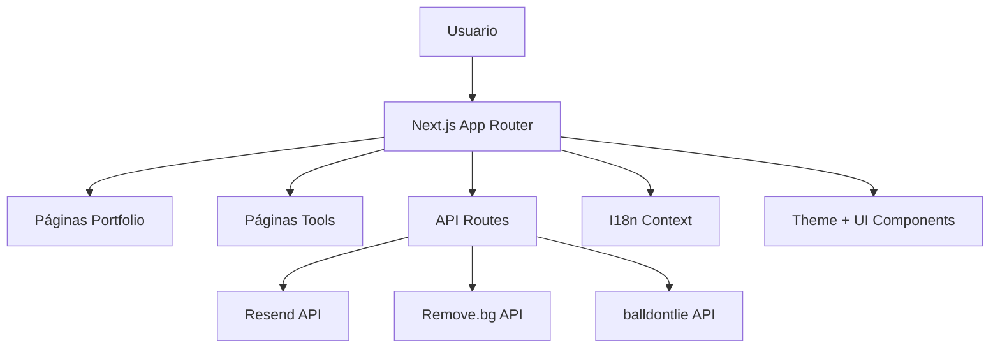

# Fernando Martínez | Dev Hub Portfolio

<p align="center">
   
   
   
   
   
</p>

<p align="center">
   Portfolio profesional + laboratorio de herramientas web orientadas a productividad, desarrollo, imagen, texto, seguridad y conversión.
</p>

---

## Vista general

Portfolio personal construido con Next.js App Router: casos de estudio de software
real, más un laboratorio de 33 herramientas web que funcionan enteramente en el
navegador. El sistema de diseño y los principios de producto están documentados en
[`DESIGN.md`](./DESIGN.md) y [`PRODUCT.md`](./PRODUCT.md) — léelos antes de tocar
la interfaz o el copy.

Incluye:
- Landing personal, casos de estudio y páginas de experiencia, stack y contacto.
- Laboratorio de 33 herramientas web reutilizables, todas client-side.
- Endpoints API internos para contacto, remove.bg y datos NBA.
- i18n en español, inglés y alemán (español es la fuente de verdad de los tipos).
- Paleta ⌘K, tema claro/oscuro diseñado (no invertido) y 20 iconos animados propios.
- Docker multi-stage para despliegue self-hosted.

---

## Índice

1. [Stack tecnológico](#stack-tecnológico)
2. [Arquitectura del proyecto](#arquitectura-del-proyecto)
3. [Rutas principales](#rutas-principales)
4. [Herramientas incluidas](#herramientas-incluidas)
5. [APIs y variables de entorno](#apis-y-variables-de-entorno)
6. [Puesta en marcha local](#puesta-en-marcha-local)
7. [Tests y CI](#tests-y-ci)
8. [Despliegue con Docker](#despliegue-con-docker)
9. [Scripts disponibles](#scripts-disponibles)
10. [SEO, OG y PWA](#seo-og-y-pwa)
11. [Contacto](#contacto)

---

## Stack tecnológico

### Core
- Next.js 16 (App Router)
- React 19
- TypeScript 5

### UI/UX
- Tailwind CSS 4
- Framer Motion (solo en las herramientas del laboratorio; el portfolio en sí no
  usa apariciones al hacer scroll — decisión deliberada, ver `DESIGN.md`)
- Lucide React
- shadcn/ui + utilidades CVA/clsx/tailwind-merge

### Tooling y utilidades
- ESLint 9
- Vitest (tests de invariantes de contenido)
- FFmpeg.wasm
- react-dropzone
- prismjs
- html2canvas

### Servicios externos
- Resend (envío de mensajes de contacto)
- Remove.bg API (eliminación de fondo)
- balldontlie API (NBA scores/stats)

La build de producción **no depende de ninguno de estos servicios**: sin las claves
de entorno, `npm run build` sigue completándose y las rutas afectadas degradan con
un error controlado en runtime, no en build time.

---

## Arquitectura del proyecto


```mermaid
flowchart TD
      A[Usuario] --> B[Next.js App Router]
      B --> C[Páginas Portfolio]
      B --> D[Páginas Tools]
      B --> E[API Routes]

      E --> F[Resend API]
      E --> G[Remove.bg API]
      E --> H[balldontlie API]

      B --> I[I18n Context]
      B --> J[Theme + UI Components]
```

Estructura principal:
- `app`: rutas, layouts, páginas y endpoints API.
- `components`: UI compartida, por sección (`case`, `home`, `stack`, `tools`...).
- `content`: datos estructurados por idioma (casos, perfil, skills, herramientas)
  — separados de `i18n`, que solo contiene strings de interfaz.
- `i18n`: contexto, traducciones y tipado de idiomas. `es.ts` es la fuente del
  tipo `TranslationKeys`; `en.ts`/`de.ts` deben tener las mismas claves.
- `icons`: iconos animados vendorizados (itshover), servidos vía `hover-icon.tsx`.
- `lib`: utilidades auxiliares.
- `tests`: invariantes de contenido (ver [Tests y CI](#tests-y-ci)).
- `public`: assets estáticos y manifest.

---

## Rutas principales

### Navegación
- `/`
- `/work`, `/work/[slug]`
- `/experience`
- `/stack`
- `/contact`
- `/tools`

### API internas
- `POST /api/contact`
- `POST /api/remove-bg`
- `GET /api/nba`

---

## Herramientas incluidas

33 herramientas, todas `"use client"`, sin envío de datos a un backend propio salvo
las tres integraciones listadas arriba. El registro completo (slug, categoría,
etiquetas de búsqueda) vive en [`content/tools.ts`](./content/tools.ts); los
títulos y descripciones en `t.tools.list` de cada fichero de traducción.

### Imagen y color
- `/tools/bg-remover`, `/tools/image-forge`, `/tools/image-compressor`,
  `/tools/exif-reader`, `/tools/color-blindness`, `/tools/palette-extractor`,
  `/tools/image-color-picker`, `/tools/gradient-generator`,
  `/tools/favicon-generator`

### Vídeo
- `/tools/video-crunch`

### Código
- `/tools/snippet-generator`, `/tools/json-formatter`, `/tools/svg-to-datauri`,
  `/tools/code-beautifier`

### Texto
- `/tools/word-counter`, `/tools/text-diff`, `/tools/lorem-ipsum`,
  `/tools/markdown-editor`

### Seguridad
- `/tools/password-generator`, `/tools/hash-generator`, `/tools/base64`,
  `/tools/text-encryptor`, `/tools/jwt-decoder`

### Conversión y datos
- `/tools/data-converter`, `/tools/unix-timestamp`, `/tools/csv-json`,
  `/tools/qr-code`, `/tools/aspect-ratio`

### Dev tools
- `/tools/gitignore-generator`, `/tools/readme-generator`, `/tools/regex-tester`,
  `/tools/cron-helper`

### Sports
- `/tools/nba-scores`

Para añadir una herramienta nueva: entrada en `content/tools.ts`, icono en
`TOOL_ICONS` de `components/tools/ToolsView.tsx`, copy en `t.tools.list[slug]` de
**los tres** ficheros de traducción, y el directorio en `app/tools/<slug>/`. El
test de `tests/content.test.ts` falla si alguno de estos falta.

---

## APIs y variables de entorno

Crea un archivo `.env.local` en la raíz:

```env
RESEND_API_KEY=
REMOVE_BG_API_KEY=
NBA_API_KEY=
```

### Detalle de uso
- `RESEND_API_KEY`: envío de mensajes de contacto (`app/api/contact/route.ts`).
- `REMOVE_BG_API_KEY`: eliminación de fondo (`app/api/remove-bg/route.ts`).
- `NBA_API_KEY`: datos NBA vía balldontlie (`app/api/nba/route.ts`).

Si una clave no está definida, la ruta correspondiente responde con un error
controlado — nunca con una build rota ni una página caída.

---

## Puesta en marcha local

### 1) Requisitos
- Node.js 20+
- npm 10+

### 2) Instalar dependencias

```bash
npm install
```

### 3) Configurar entorno (opcional)

```bash
cp .env.local.example .env.local  # si existe; si no, crea .env.local a mano
```

Sin este paso el sitio funciona igual: solo degradan las tres integraciones
externas.

### 4) Ejecutar en desarrollo

```bash
npm run dev
```

Abre http://localhost:3000

---

## Tests y CI

```bash
npm test
```

`tests/content.test.ts` valida invariantes de contenido que TypeScript por sí
solo no cubre: que `skills` tenga el mismo número de grupos e items en los tres
idiomas, que `tools.list` tenga una entrada por cada slug de `content/tools.ts`
en los tres idiomas, y que cada slug tenga su directorio correspondiente en
`app/tools/`.

`.github/workflows/ci.yml` corre `lint`, `tsc --noEmit`, `test` y `build` en cada
push y pull request — **sin ningún secreto configurado**, a propósito: es la
comprobación de que la build nunca depende de un servicio externo en tiempo de
compilación.

---

## Despliegue con Docker

El proyecto incluye Dockerfile multi-stage y docker-compose para producción.

⚠️ **No ejecutar `docker compose` dentro de un clon de desarrollo**: el nombre de
proyecto se deriva del directorio y puede colisionar con un stack ya desplegado.
Para previsualizar localmente, usa `npm run build` y sirve `.next/standalone` en
otro puerto.

### Levantar contenedor

```bash
docker compose up -d --build
```

### Detalles relevantes
- Puerto publicado: 80 → 3000
- Contenedor: `mi-portfolio-nextjs`
- Reinicio automático: `always`
- Imagen final optimizada usando salida standalone de Next.js

### Variables en Docker Compose

El compose ya contempla `RESEND_API_KEY`, `REMOVE_BG_API_KEY` y `NBA_API_KEY`,
pasadas por entorno del host o un archivo `.env`.

---

## Scripts disponibles

```bash
npm run dev      # Entorno desarrollo
npm run build    # Build producción
npm run start    # Arranque en modo producción
npm run lint     # Linting con ESLint
npm test         # Tests de invariantes de contenido
```

---

## SEO, OG y PWA

El proyecto incorpora:
- Metadata SEO centralizada en el layout, con metadata propia por página principal.
- JSON-LD `Person` en el layout y `Article` por caso de estudio.
- Open Graph/Twitter metadata para compartir en redes.
- Imagen Open Graph dinámica en `/opengraph-image`.
- `manifest.json` para soporte PWA básico.
- `sitemap.xml` y `robots.txt` generados desde el contenido real (casos y
  herramientas), sin listas duplicadas a mano.

---

## Contacto

Si quieres colaborar, proponer mejoras o reportar incidencias:

- Web: https://fmargar.es
- Email: fmargardeveloper@gmail.com

---

<p align="center">
   Hecho con café, TypeScript y muchas ganas de construir cosas útiles.
</p>
